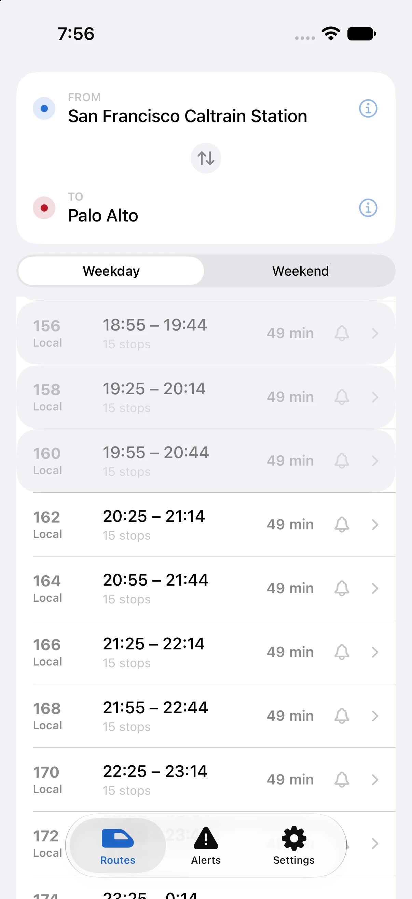
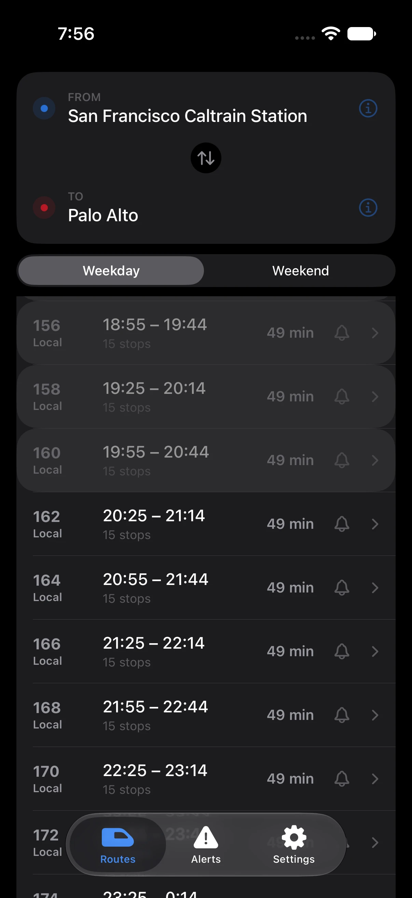
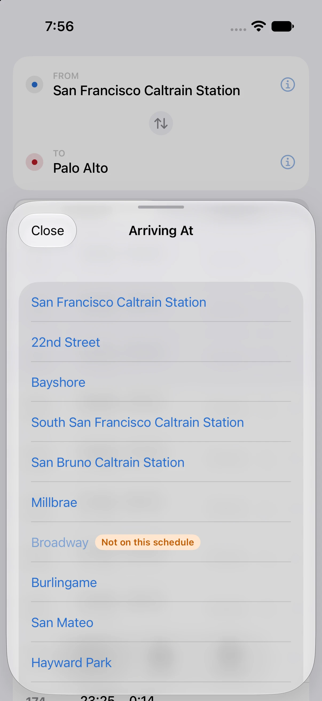
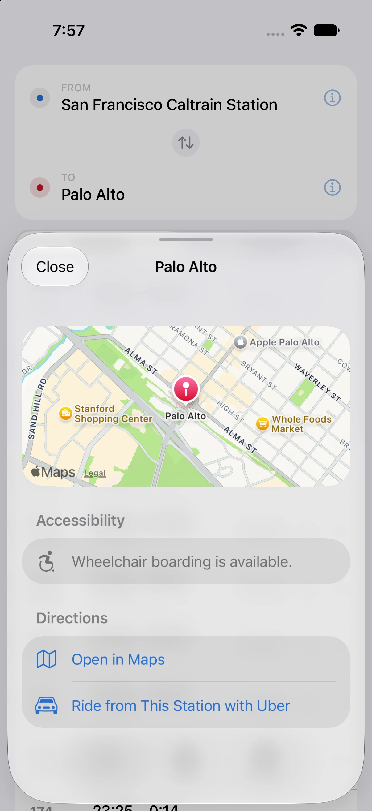
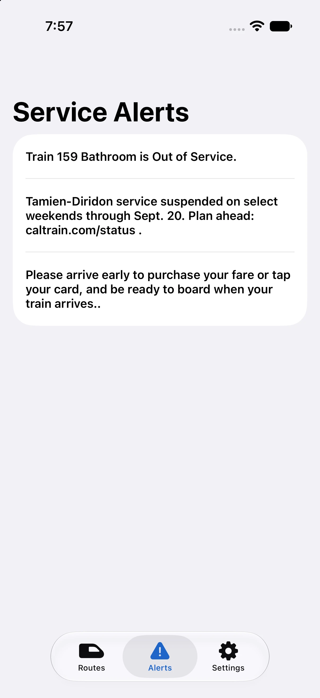
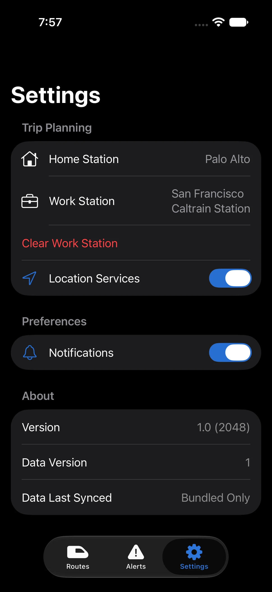

# Baby Bullet

iOS app (Swift 6, iOS 26+, SwiftUI) to help riders plan Caltrain trips: timetables, stations, service status.

## Features

- **Home / Routes** — today's remaining departures from your home (or nearest) station, holiday-schedule banner when it applies
- **Trip planning** — origin/destination station picker across Weekday/Weekend/Holiday schedules
- **Station detail** — per-station departures, accessibility notes, one-tap Apple Maps directions
- **Stop-by-stop trip detail** — every stop a train/trip makes, with per-stop times
- **Live train tracking** — on-time/delayed/early status per stop from 511's real-time feed
- **Service alerts** — merged from 511 and Caltrain's own PADS feed, deduped
- **Tracked trip: notifications + Live Activity** — track a trip, get a leave-now reminder, delay alerts, and a Lock Screen/Dynamic Island Live Activity
- **Widgets** — Home Screen and Lock Screen widgets for next departures, with Home↔Work reverse
- **Settings** — Home/Work stations, location toggle, notifications toggle, all synced to a local SQLite store
- **Remote data updates** — schedule/holiday data refreshes without an App Store release (see [`docs/REMOTE_DATA_UPDATES.md`](docs/REMOTE_DATA_UPDATES.md))

Full detail and what's not built yet: [`docs/FEATURES.md`](docs/FEATURES.md).

<p align="center">
  
  
  
  <br>
  
  
  
</p>

## 511 Open Data

Timetable, holiday, and stop data comes from the [511.org Open Data](https://511.org/open-data) API.

**You need your own 511 Open Data token to run the import scripts.** Request one free at [511.org/open-data](https://511.org/open-data) — it's not included in this repo and must never be committed.

The API spec this project was built against is `docs/511_SF_Bay_open_data_specification-Overview_2026.pdf`. Before relying on it, check [511.org/open-data](https://511.org/open-data) for a newer version — the spec updates independently of this repo and may have moved on since 2026.

## Setup

1. Copy `.env.example` to `.env` and fill in your token:
   ```
   FIVE_ELEVEN_API_TOKEN=your_token_here
   ```
2. Install script dependencies:
   ```
   pip install -r scripts/requirements.txt
   ```
3. Open `CT.xcodeproj` in Xcode.

## Importing 511 data

Run scripts from `scripts/` on demand (not part of the app build or CI) to pull data down to `scripts/data/` as JSON:

| Script | Fetches |
|---|---|
| `gtfs_operators.py` | Operators with a GTFS dataset (filtered to Caltrain by default) |
| `gtfs_feed_download.py` | Full GTFS + GTFS+ dataset zip for an operator |
| `timetable.py LINE_ID` | Route timetable for a line |
| `stop_timetable.py STOP_ID` | Scheduled departures/arrivals at a stop |
| `holidays.py` | Service exceptions/holidays for an operator |
| `stops.py` | List of stops (id, name, location) |
| `stop_places.py` | Detailed physical stop places |

All default `--operator-id` to `CT` (Caltrain). See each script's docstring for full usage.

## Building the bundled database

The app ships with a prebuilt SQLite database (`CT/Resources/BabyBullet.sqlite`) rather than
fetching 511 data at runtime. To regenerate it after a schedule change:

```
python gtfs_feed_download.py
mkdir -p data/gtfs_extract && (cd data/gtfs_extract && unzip -o ../gtfs_CT.zip)
python build_db.py
```

Rebuilding just updates the file on disk — apps already installed don't see it until you
publish it (below) or the next App Store release re-bundles it.

## Publishing a remote data update

Schedule/holiday data can be pushed to installed apps without an App Store release — the
app polls a GitHub Release once a day and swaps in the new timetable tables if it finds a
newer one. See `docs/REMOTE_DATA_UPDATES.md` for the full design. Requires the `gh` CLI,
authenticated against this repo.

```
python gtfs_feed_download.py
mkdir -p data/gtfs_extract && (cd data/gtfs_extract && unzip -o ../gtfs_CT.zip)
python publish_release.py
```

`publish_release.py` runs `build_db.py` itself, so you don't need to run it separately —
the two commands above are enough. It then uploads `BabyBullet.sqlite` and a `latest.json`
manifest (schema version, data version, checksum) to the rolling `latest` GitHub Release tag.
Pass `--skip-build` to publish the file already at `CT/Resources/BabyBullet.sqlite` as-is
instead of rebuilding it, or `--data-version N` to force a specific version number instead
of auto-incrementing from the currently published one.

This only works for **data** changes (new schedules, holidays) against the app's current
schema — a schema change (new/changed tables or columns) still requires an app update, since
remote updates refuse to apply if the manifest's `schema_version` doesn't match what the
installed app expects.

## Development

See `CLAUDE.md` for stack conventions, persistence design, and build/test commands.

## License

See [`LICENSE.md`](LICENSE.md) — source-available, share-alike, App Store distribution
reserved to the original developer. Covers Caltrain trademark, 511.org data terms, and
app icon provenance too.
